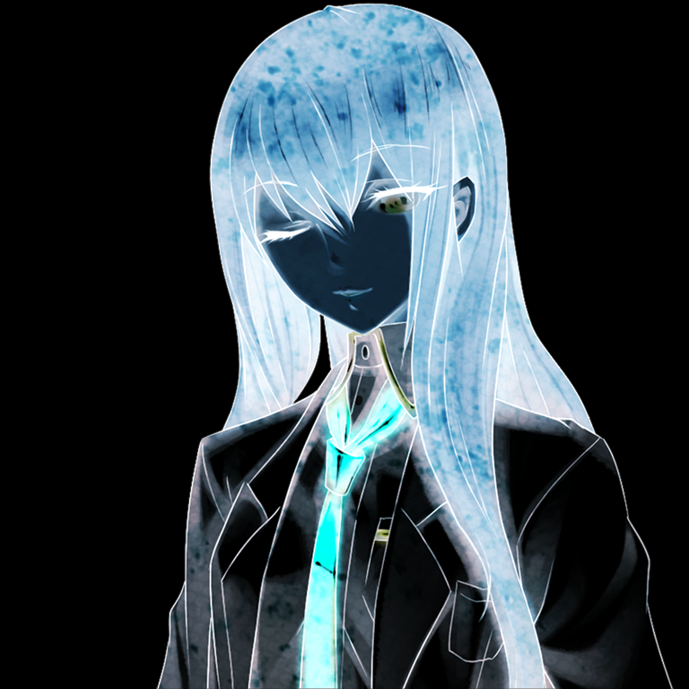
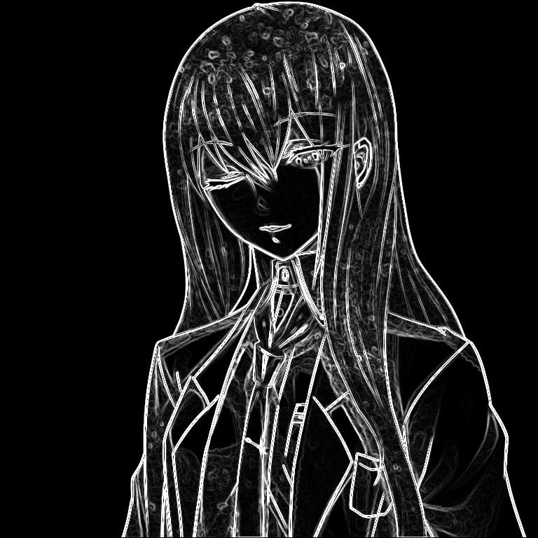
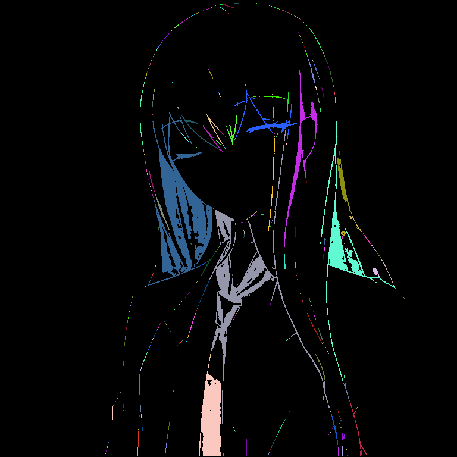

# Auge

> *Observe... and reshape the visual world line.*

**Auge** is a command-line artifact forged in the fires of Rust, designed to manipulate the fabric of visual perception. It serves not merely as a tool, but as an extension of the user's will, seamlessly integrating into the data streams of Unix-style pipelines to chain alterations to reality itself.

Whether you seek to blur the edges of existence, drain the chromatic essence from an image, or reconstruct it through the lens of pointillism, Auge stands ready. It can even project the results directly into your ocular interface (terminal), detecting advanced protocols like iTerm or Kitty, or falling back to primitive block representations if necessary.

## The Ritual of Summoning

To manifest this apparatus within your local environment, you may acquire pre-compiled instances for Windows (x86_64) and Linux (x86_64, aarch64) from the [release zone](https://github.com/metdxt/auge/releases/latest).

Alternatively, those proficient in the ways of `cargo` may compile it from the source ether:

```bash
# Initiate synchronization sequence
cargo install auge

# OR forge directly from the source repository
# cargo install --git https://github.com/metdxt/auge
```

## Invocation

Once materialized, the apparatus responds to the following incantations:

```bash
auge [OPTIONS] <COMMAND>
```

Consult the internal knowledge base via `auge --help` or `auge <COMMAND> --help` to uncover the deeper secrets of each operation.

## The Grimoire (Capabilities)

Auge possesses a vast array of "Reality Alteration Protocols" (filters) to modify input data:

| Incantation | Effect | Example output |
|-------------|--------|----------------|
| `view` | **Passive Observation.** Projects the image onto the terminal without alteration. |  |
| `grayscale` | **Chromatic Drain.** Strips the image of color, leaving only luminance. |  |
| `g-blur` | **Gaussian Diffusion.** Softens reality by blurring pixels (`-s` for strength). |  |
| `dotart` | **Pointillist Reconstruction.** Renders the image as a matrix of dots. Customizable colors, thresholds, and can even output raw JSON data representing the dots. |  |
| `dynthres` | **Luma Severance.** Dynamic thresholding to separate light from dark based on percentiles. |  |
| `resize` | **Spatial Distortion.** Alters the dimensional proportions of the image (`target` resolution or %). |  |
| `invert` | **Polarity Reversal.** Inverts the colors, creating a negative of the current reality. |  |
| `sepia` | **Temporal Patina.** Applies an antique tone, simulating the passage of time. |  |
| `edge` | **Boundary Revelation.** Highlights the edges where perceptions shift. |  |
| `blob-detect` | **Entity Identification.** Detects and colors connected blobs of pixels based on color or luminance. |  |

### Advanced Manipulation

*   **Stream Chaining:** Auge thrives in the flow. It reads from `stdin` and writes to `stdout`, allowing you to chain multiple instances to perform complex rituals.
*   **Ocular Projection:** If no output file is specified and the destination is a terminal, Auge automatically attempts to render the image directly to your view.

## Known Realms (Supported Formats)

The apparatus can decipher and encode a multitude of visual formats across the multiverse:

| Format     | Input (Decode)         | Output (Encode)         |
|------------|------------------------|-------------------------|
| AVIF       | ✗ (The void resists)   | ✓                       |
| BMP        | ✓                      | ✓                       |
| DDS        | ✓                      | ✗                       |
| Farbfeld   | ✓                      | ✓                       |
| GIF        | ✓                      | ✓                       |
| HDR        | ✓                      | ✓                       |
| ICO        | ✓                      | ✓                       |
| JPEG       | ✓                      | ✓                       |
| OpenEXR    | ✓                      | ✓                       |
| PNG        | ✓                      | ✓                       |
| PNM        | ✓                      | ✓                       |
| QOI        | ✓                      | ✓                       |
| TGA        | ✓                      | ✓                       |
| TIFF       | ✓                      | ✓                       |
| WebP       | ✓                      | ✓                       |

## Demonstrations of Power

**Scenario I: The Chromatic Shift**
Transform a PNG into a grayscale artifact, blur its essence, and seal it into a new vessel.

```bash
auge -i input.png grayscale | auge g-blur -s 3 > output.png
```

**Scenario II: The Pointillist Vision**
Gaze upon an image directly in your terminal, reconstructed as dot art with a custom background.

```bash
auge -i input.jpg dotart --bg-color "#1a1a1a" --scale 12
```

**Scenario III: Detecting Anomalies**
Identify red blobs in the visual field and visualize them as a heatmap.

```bash
auge -i input.png blob-detect --color "#FF0000" --threshold 30 --mode heatmap
```

## The Covenant

This apparatus is distributed under the **MIT License**. You are free to use, modify, and distribute it across the timelines, provided the ancient texts (license headers) remain intact.
